# Startup Office

## Version History

| Version | Date | Changes |
|---|---|---|
| 1.0.13 | 2026-09-15 | **Added:** persistence: floors and their figures (looks, role prompts, XP, levels), quests, chat, sprints, which floors already read their repo, and the mute setting are saved to `state.json` in the app's data folder (written through a temp file, half a second after the last change, and on close) and restored on the next start; each floor's repository is adopted again on start; a corrupt file is moved to `state.json.bak` and a dismissable notice says so; `DSNotice`. **Changed:** after a restart every figure starts idle, open quests count as failed and open sprints are closed, since their `claude` sessions are gone |
| 1.0.12 | 2026-09-15 | **Added:** XP and levels: every finished run pays 50 XP ("+50 XP" floats up in green), a failed quest hits for 10 (red "-10", the figure flashes and shakes), levels follow a curve (level 2 at 100 XP, 3 at 300, 4 at 600…) and a level-up bursts gold sparks with "LEVEL UP!", posts "Level up! I am level N now." in the chat and puts "LvN" in the name tag; the dialog box shows level and XP progress; chiptune stings synthesized on Web Audio (level-up arpeggio, failure thud, cheer on a closed sprint) with a mute button in the navbar; `settingsStore`; level-up capture script. **Changed:** a level, once reached, is never lost even when XP drops |
| 1.0.11 | 2026-09-15 | **Added:** movement: figures that are not working get up now and then, walk to a spot in their own room and come back (two-frame walk at 4.5 tiles/s, tile pathfinding around desks and through the doors); sprints: **Start sprint** in the HUD takes a goal, calls the whole team to the meeting room, the product manager's `claude` session splits the goal into one task per teammate (JSON plan, read-only look at the repo), every part becomes a quest, each figure says its part at the table, the planner announces "Here's the plan: N tasks", and everyone walks back to work; sprint board with goal, status, progress bar and the quests, and a New sprint button once it closed; the sprint closes when every quest ends, with confetti and a summary in the chat; the first figure plans when there is no product manager; `sprintsStore`; `figure:says` and `sprint:closed` events from React to the office; sprint capture scripts; runs can carry `isPriority` so the planning session jumps the floor's queue (priority runs keep their own order). **Changed:** a figure's `meeting` state sends it to the meeting table and holds while the plan is being made (run events are held back, then everyone settles into what their runs left them with); a figure's chat reply lands before its quest status flips, so the sprint summary comes last; `giveTask` returns the quest and has a per-floor variant; closing a floor tab also clears its sprints. **Fixed:** the office refits when the HUD grows or the window narrows (the camera remembers its fit zoom, the canvas host can shrink); removing a figure no longer throws; door walls block on both sides of the gap (the Operations kitchen moved to the corners so its door stays reachable); planning runs stay out of speech bubbles |
| 1.0.10 | 2026-09-15 | **Changed:** review fixes for the dialog box and HUD chat: a quest's run id is attached inside the start mutation so two quick asks never lose a reply; the greeting is frozen when the box opens (no restart while the run streams); the box closes on a floor switch, on Escape, focuses its first choice and hands focus back; @mentions accept punctuation, multi-word and non-Latin names, unknown mentions stay in the text; Enter ignores IME composition; chat history capped per floor; HUD height capped so the office never collapses; shared text helpers, `findFigure`, close icon and success/danger color tokens; shared test helpers and more tests. **Fixed:** README safety section says runs are read-only; spec model and error table brought up to date |
| 1.0.9 | 2026-09-15 | **Added:** NPC dialog box: clicking a figure opens a MapleStory-style box with its portrait, a typed greeting (hello, what it is doing right now, or its last result) and the choices Give a task / Show your work / Bye; HUD bar under the office with quest counts (active, done, failed), the chat history and a chat box: an ask goes to the figure you @mention, else to the one whose job or keywords match (tests → QA, api → backend, budget → accountant…), else to the product manager; every ask becomes a quest and the figure's reply lands in the chat when its run ends; tasks store; `startupOfficeDev.clickFigure` dev hook for captures. **Changed:** figure clicks open the dialog box instead of the agent panel (the panel opens from Show your work or the Agents button); `DSInput` can carry its own aria-label; closing a floor tab now clears its runs, quests and chat; every run, tasks included, is read-only for now (Read, Grep, Glob) |
| 1.0.8 | 2026-09-15 | **Added:** figure states in the office: a typing animation (arms on the keyboard) while a figure works, a badge above the name tag (animated dots while working, green tick when done, red cross on error) and a MapleStory-style speech bubble that shows the figure's latest output line, tool note, first result line, error, or "Stopped." when you stop it, so on load you watch the whole team read the repo. **Changed:** the scene now diffs figure state and run output from the stores instead of only seating and removing figures |
| 1.0.7 | 2026-09-15 | **Added:** agent runner: every figure can run a real `claude` session on its floor's repository; when a floor becomes ready each figure automatically reads the repo from its role's point of view (three sessions at a time, the rest queued); agent panel opened by clicking a figure or the Agents button, with the role prompt (editable), an ask/assign box, Read the repo, Run and Stop, live streamed output with tool notes, result, turns, and earlier runs; `claude` availability check with an inline hint when it is missing. **Changed:** figure state follows its run (working, done, error) |
| 1.0.6 | 2026-09-14 | **Added:** floors: a side panel with one tab per repository, like workspaces in a terminal multiplexer; New floor dialog takes a GitHub URL or a local folder (with a native Browse picker), then shows a progress bar while the repo is prepared and the default team is hired one figure at a time; each floor has its own figures and repo status; empty-office state; `DSProgressBar`. **Changed:** Load repo dialog and single global repo status replaced by floors; repo IPC takes a floor id; Add figure works on the active floor. |
| 1.0.5 | 2026-09-14 | **Added:** Load repo dialog: paste a GitHub URL, the main process clones it shallowly into the app data folder (or pulls when it is already there) and pushes status over IPC; navbar chip with the repo name and a state dot (cloning, ready, failed); typed IPC bridge (`window.office.repo`), controller + service split, standard `successResponse` / error shape, TanStack Query hooks for main-process data. **Changed:** Load repo button enabled; app name pinned to `startup-office` so packaged builds use the same data folder as dev; review fixes: status is fetched on start, git never prompts and times out, broken clones are re-cloned, Enter submits the URL |
| 1.0.4 | 2026-09-14 | **Added:** Add figure dialog (name, job, department with seats left, hair style, accessory, six colors, role prompt, live pixel preview); figures store (Zustand) that seats new figures on the next free desk; the scene subscribes to the store; design kit: `DSModal`, `DSField`, `DSInput`, `DSSelect`, `DSTextArea`, `DSColorInput`; one or two spare desks per department; `STARTUP_OFFICE_SCRIPT` dev hook to drive the page before a capture. **Changed:** Add figure button enabled; plants moved in R&D and Marketing to make room for the spare desks; review fixes: modal keeps focus while typing, traps Tab, restores focus and ignores drags onto the backdrop; selects show a chevron; errors linked to their inputs; store validates text; scene unsubscribes on destroy |
| 1.0.3 | 2026-09-14 | **Added:** office rebuilt to the owner's design package: opaque blue walls (tall far walls, low near rims, 0.6-tile-thick interior walls with door gaps), windows, whiteboards, charts, sticky notes, posters, rugs, per-room floors (tile, orange, checker, corridor runner), department furniture kits (server rack, bookshelf, meeting table + chairs, kitchen counter, fridge, round table, stools, water cooler, sofa, filing cabinet, safe), desk props (mug, lamp, paper, keyboard); responsive down to a 300px window: navbar collapses to icon buttons, camera fits the office and supports wheel zoom + drag pan; `STARTUP_OFFICE_WINDOW=WxH` dev override. **Changed:** window minimum 1024×640 → 300×300, responsive rule now 300px; macOS traffic-light inset applied only on macOS; review fixes: wall decor depth, click vs drag, listener teardown, exterior walls batched into one object. **Removed:** glass-wall look |
| 1.0.2 | 2026-09-14 | **Added:** desks, meeting table and reception desk in the isometric rooms; 16 default chibi figures (one per job) composed from a shared pixel template with hair styles, accessories and per-figure colors; idle bob and blink; name tag that expands to the job on hover; click emits `figure:clicked` on the game event bus. **Changed:** walls drawn per tile and depth-sorted against figures and desks; `RoomKey` moved to `src/shared/figures.ts` |
| 1.0.1 | 2026-09-14 | **Added:** isometric office floor on one page (7 rooms around a lobby corridor, glass walls, door gaps, floor slab, tile grid), app icon, dev self-screenshot hook. **Changed:** view is an isometric floor plan instead of a side-scroller; the CEO is the player outside the office, not a figure |
| 1.0.0 | 2026-09-14 | **Added:** design spec, README, coding rules (`CLAUDE.md`), Electron + React + Phaser scaffold, navbar shell, `DSButton` design kit, logger, Vitest setup |

A MapleStory-style desktop game where your startup is a pixel office and every
employee is a real Claude Code agent. You are the CEO. Walk the office, talk to
your team, hand out tasks, and watch the work flow from room to room.

> Paste a GitHub repo, and the office comes alive: the frontend dev reads your UI
> code, the backend dev reads your API, the marketer reads your landing page, and
> each one reports back in a speech bubble.

## What it is

Startup Office runs on your Mac as an Electron app with a Phaser 3 game inside.
The whole office is on one screen, an isometric floor plan in the style of the owner's
[design package](docs/design/handoff.md): opaque blue walls, windows on the far wall, a different
floor and furniture kit per department:


Every figure is drawn from one pixel template plus a hair style, an accessory and its own
colors, so adding a new employee is a data change, not new art.

| Department | Who works there |
|---|---|
| R&D | Frontend dev, Backend dev, UI/UX designer, QA engineer, DevOps |
| Product | Product manager, Data analyst |
| Marketing | Content marketer, Growth marketer, Designer |
| Sales | Sales rep, Customer success |
| Finance | Accountant, Fundraising lead |
| Ops / HR | Office manager, Recruiter |
| Meeting room | Where the team meets for sprint planning; the board is in the HUD |
| Lobby | The corridor every room opens onto |

Every figure is an agent. Behind it runs a real `claude` CLI session with a role
prompt and your repo as its working directory. When a figure is working, it sits at
its desk typing, and a speech bubble above it shows the agent's latest line.

## How you play

1. **See everything.** The whole office fits on one page. You are the CEO looking down
   at it. You are not a figure; every figure is an employee.
2. **Add a floor.** Every repository is a floor. Press **New floor** in the side panel, paste a
   GitHub URL or pick a folder on your Mac, and watch the progress bar: the repo is cloned, then
   the default team is hired one figure at a time. Tabs switch between floors; the chip in the
   navbar shows the active floor's repository. From task 8 on, every figure explores the part of
   the code that matches its job.

   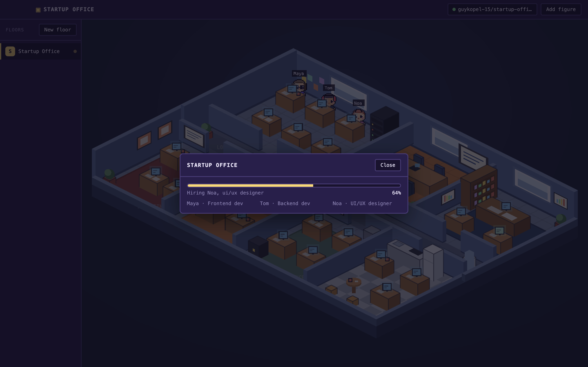

   
3. **Talk.** Click a figure. A MapleStory-style dialog box opens with its portrait and what it
   has to say: a hello, that it is queued, what it is doing right now, or the result of its last
   run (or that it stopped). Click the text to reveal it at once, Escape closes. Choose
   **Give a task** to type one, **Show your work** for the agent panel (role prompt, live output,
   earlier runs, Stop), or **Bye**. When a floor becomes ready every figure has already started
   reading the repo from its own point of view. In the office each working figure types, animated
   dots count above its name, and a speech bubble says what it is doing right now. A green tick
   means done, a red cross means the run failed.

   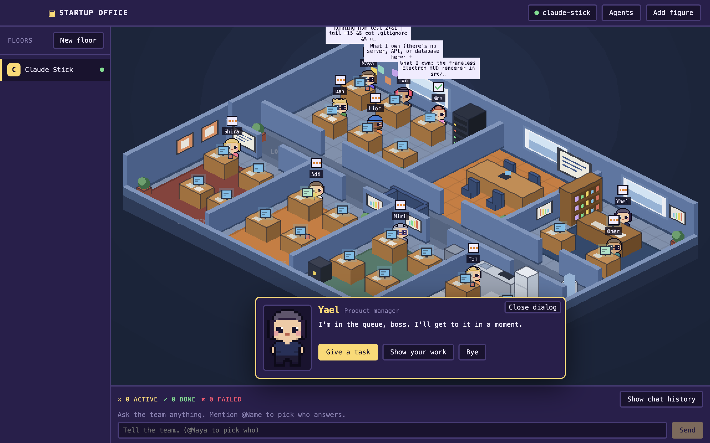

   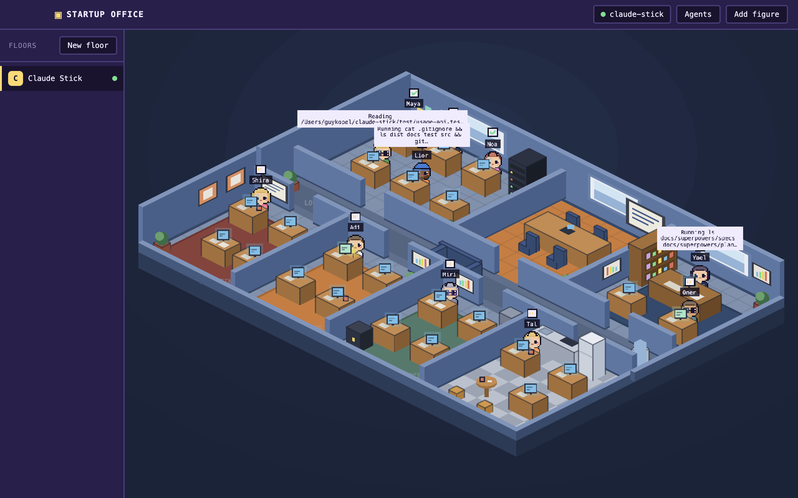

   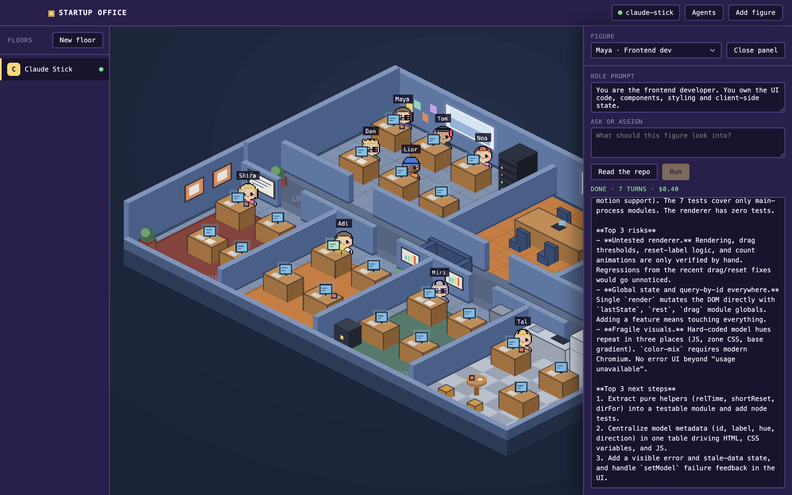
4. **Chat with the team.** The bar under the office is the HUD: quest counts and a chat box.
   Type an ask and press Enter. Mention `@Dan` to pick who takes it; otherwise it goes to the
   figure whose job or keywords match (tests → QA, api → backend, budget → accountant…), and to
   the product manager (or the first figure) when nothing matches. Every ask is a quest; the reply
   lands in the chat when the figure's run ends. Runs are read-only for now, so a figure reports
   what it would change rather than changing it.

   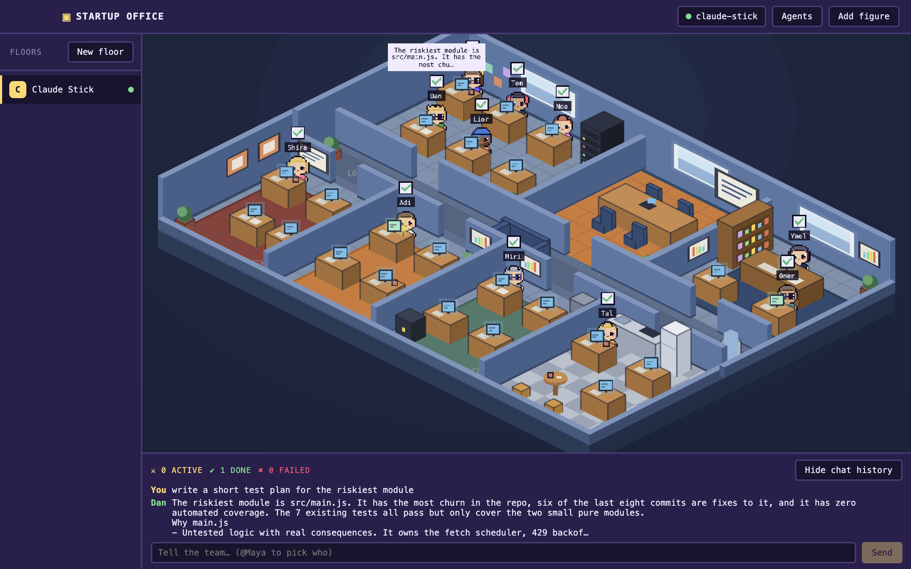
5. **Run sprints.** Press **Start sprint** in the HUD and type the goal. Everyone walks to
   the meeting room, the product manager reads the repo and splits the goal into one task per
   teammate, each figure says its part at the table, then walks back and works on it. The sprint
   board shows the goal, the progress bar and every quest with its assignee; when the last quest
   ends the sprint closes with confetti and a summary in the chat. Between tasks, figures get up
   and wander their own room.

   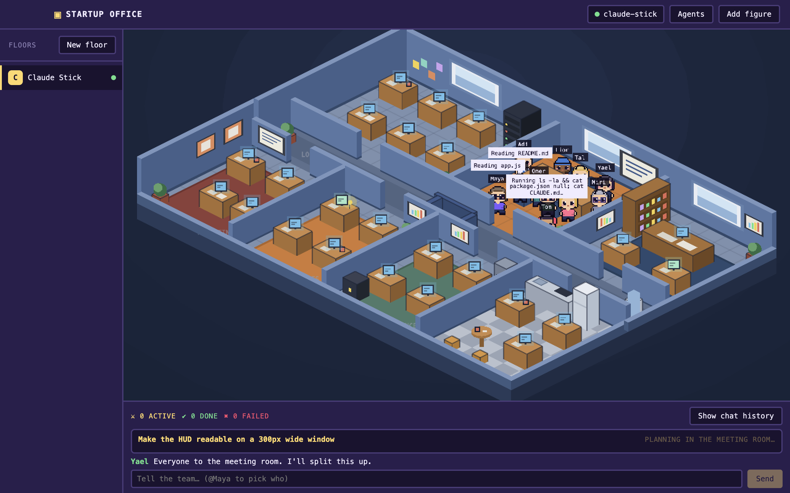

   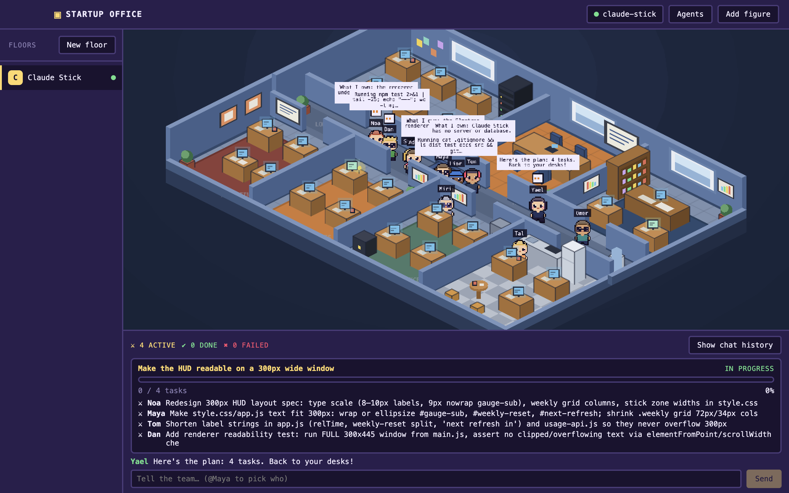
6. **Grow the team.** Press **Add figure** in the navbar (the `+` button in a narrow window).
   Pick a department with a free desk, give the person a name, job and look, optionally a role
   prompt (it defaults from the job), and they sit down.

   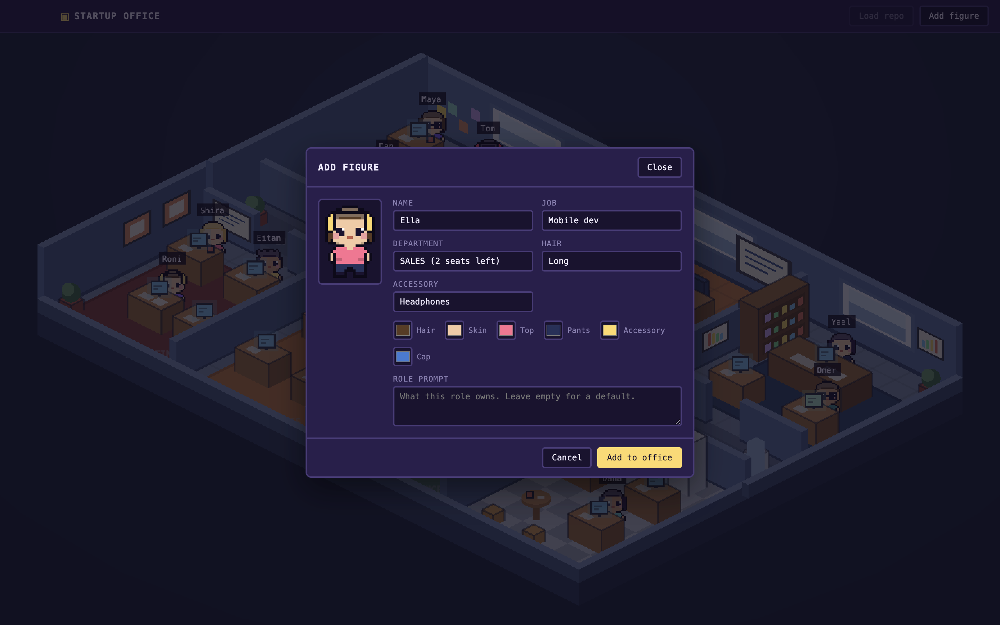
7. **Level up.** Every finished run pays XP ("+50 XP" floats up), a failed quest hits for 10
   (red numbers, a flinch). At 100 XP a figure reaches level 2 with a gold burst, a chiptune
   sting and a "LvN" tag; the dialog box shows its XP bar. The navbar's speaker button mutes
   every sound.

   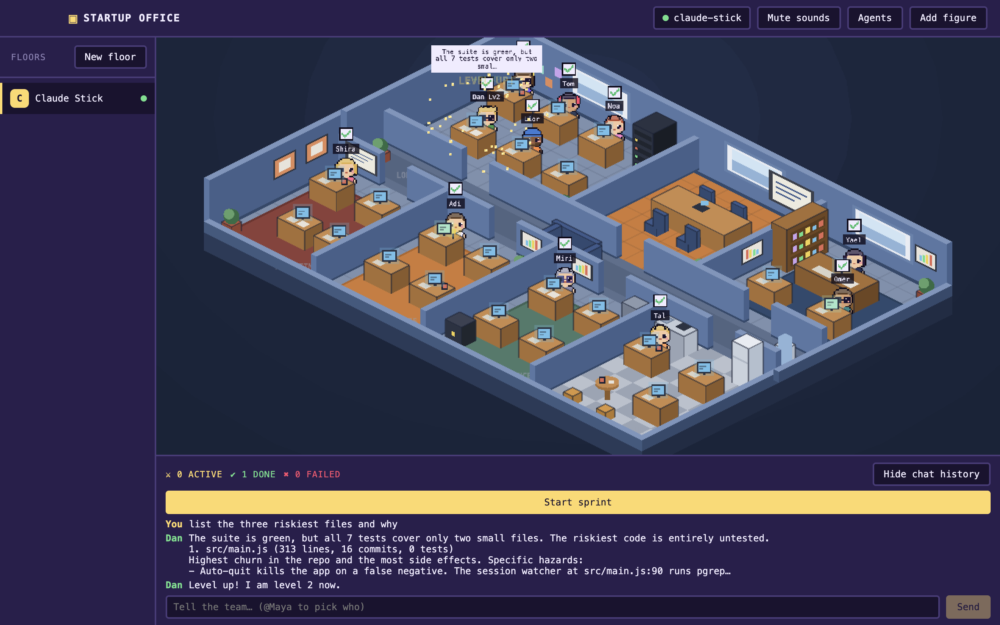
8. **Come back tomorrow.** Everything is saved as you go: floors, figures with their levels,
   quests, chat, sprints and the mute setting. The next start restores the office as it was, with
   every figure back at its desk; a repository folder that moved shows its error in the chip.

   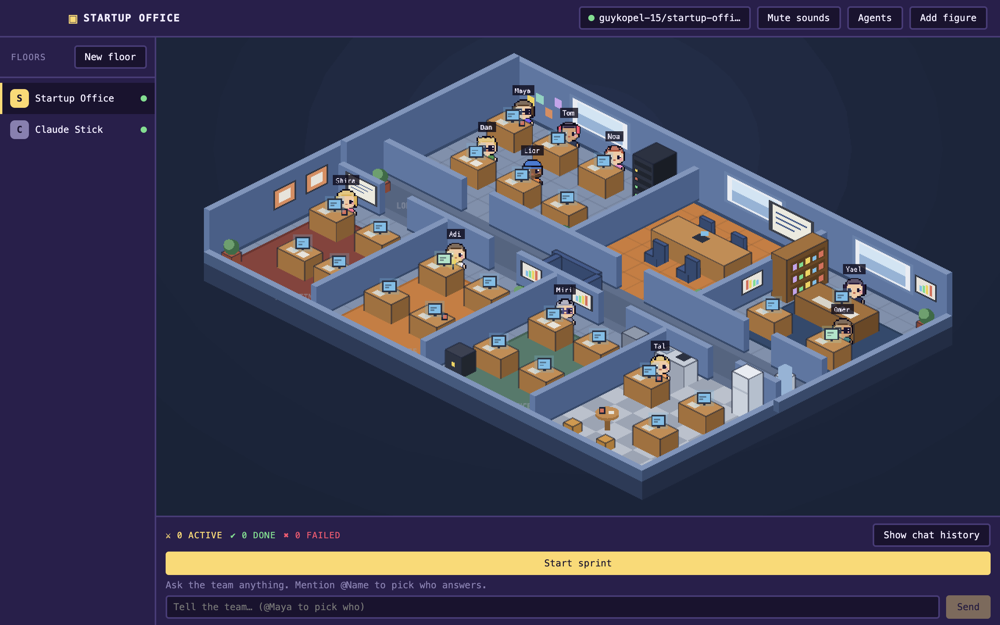
   Closing a sprint throws confetti.

## The game layer

| Element | What you get |
|---|---|
| World | Isometric floor plan: seven rooms around a lobby corridor, opaque walls with windows and decor, per-room floors and furniture |
| Characters | Idle bounce, desk typing, two-frame walk cycle facing left or right, wandering and meetings |
| Floors | Side panel with one tab per repository; each floor has its own team |
| HUD | Bottom bar: quest counts, sprint board (goal, status, progress, quests), chat history and the chat box that routes asks to figures |
| Dialog | MapleStory-style NPC dialog box for every figure: portrait, typed greeting, Give a task / Show your work / Bye |
| Juice | Floating XP and damage numbers, level-up spark burst, confetti on a closed sprint, synthesized chiptune stings with a mute button |

## Stack

| Layer | Tech |
|---|---|
| Shell | Electron |
| UI | React, TypeScript, Vite, Zustand, TanStack Query |
| Game | Phaser 3 |
| Agents | `claude` CLI (`claude -p --output-format stream-json`), read-only tools for every run today, three sessions at a time |
| Storage | JSON files and cloned repositories in the Electron user data folder |
| Tests | Vitest, Testing Library |

## Requirements

- macOS
- Node 20+
- [Claude Code](https://claude.com/claude-code) installed and logged in (`claude` on PATH)
- `git` on PATH

## Run

```bash
npm install
npm run dev
```

Other scripts: `npm test`, `npm run typecheck`, `npm run build`, `npm run icon` (regenerates
`build/icon.png` from pixel rows), `npm run package` (dmg). Set `STARTUP_OFFICE_SCREENSHOT=out.png`
when launching to capture the window to a file and quit, which is how the README images are made.
`STARTUP_OFFICE_WINDOW=300x600` opens the window at a given size, for checking small layouts.
`STARTUP_OFFICE_SCRIPT=<file>` (together with `STARTUP_OFFICE_SCREENSHOT`) runs a script in the page
before the capture, to open dialogs or fill forms. Saved state lives in `~/Library/Application Support/startup-office/state.json` (delete it to start fresh); `npm run screenshot-scripts` writes the eleven page scripts used
for the README images into `scripts/screenshots/generated/` (`floorsReady.js` clones this repo; `figureStates.js` runs real `claude` sessions on a local folder and waits 45 s, or `--hold-ms=<n>`, for the badges and bubbles; `dialogBox.js` opens the box through the dev-only `window.startupOfficeDev.clickFigure` hook; `hudChat.js` types into the chat and waits for the reply; `sprintMeeting.js` and `sprintBoard.js` start a sprint and capture the meeting and, later, the plan; `levelUp.js` asks one figure something and captures the burst when it finishes). All three variables are ignored in packaged builds. The app works down to a 300px wide window:

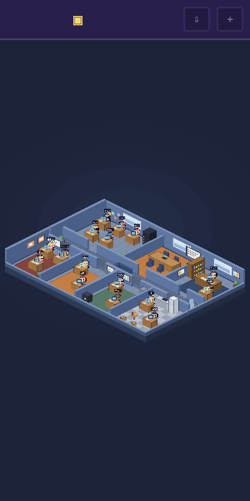

## Build plan

One task = one branch = one pull request, built in order.

| # | Task | Deliverable | Status |
|---|---|---|---|
| 0 | Spec + repo | Design doc, README, GitHub repo | ✅ |
| 1 | Electron scaffold | Window opens, React + Vite + TS, navbar shell, empty Phaser scene | ✅ |
| 2 | Office map | Isometric floor on one page: rooms, corridor, glass walls, doors, app icon | ✅ |
| 3 | Figures + desks | Desks per room, one detailed figure per job, idle animation, name tag, click emits event | ✅ |
| 4 | Office style | Owner's design package: opaque walls, windows, decor, per-room floors and furniture kits; responsive to 300px | ✅ |
| 5 | Add figure | Dialog with department, job, look and role prompt; new figure sits at a free desk | ✅ |
| 6 | Repo intake | Load repo dialog, shallow clone via git, status chip in the navbar | ✅ |
| 7 | Floors | Side panel with a tab per repository, New floor dialog with a progress bar, default team per floor | ✅ |
| 8 | Agent runner | `claude -p` per figure, streamed to a panel, intake run on repo load | ✅ |
| 9 | Figure states | typing while working, done tick / error cross badge, speech bubble with the latest line | ✅ |
| 10 | NPC dialog + HUD chat | Dialog box on click with Give a task / Show your work; HUD chat routes an ask by @mention or keywords; quests and replies | ✅ |
| 11 | Movement + sprints | Figures wander their room; Start sprint → planning meeting → one quest per figure → board, progress, confetti | ✅ |
| 12 | XP + juice | XP per run, levels, level-up burst, damage numbers, synthesized stings with mute | ✅ |
| 13 | Persistence | Floors, figures, quests, chat, sprints and settings survive a restart | ✅ |
| 14 | Polish | Screenshots, GIF, packaged `.dmg` | ☐ |

Full design: [docs/superpowers/specs/2026-09-14-startup-office-design.md](docs/superpowers/specs/2026-09-14-startup-office-design.md)

## Safety

Agent output is displayed, never executed. Agents run with your repo as their working
directory. Today every run is read-only (Read, Grep, Glob), so figures report what they
would change; edit runs will arrive later, and you review before you commit.

## License

MIT
