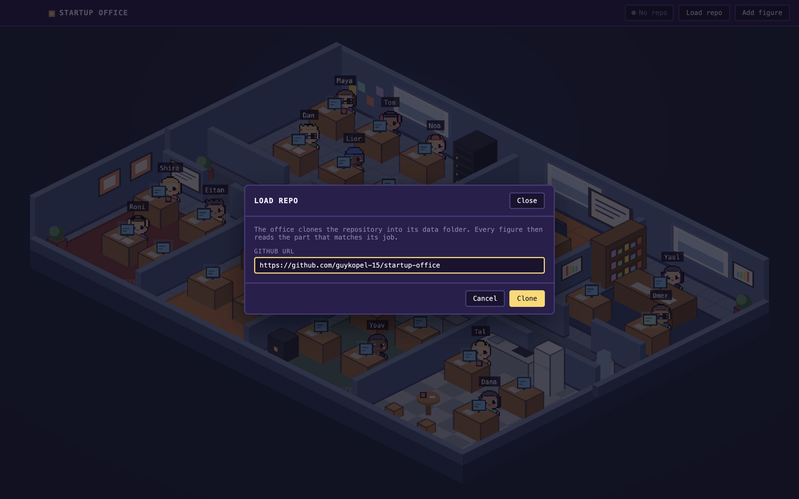
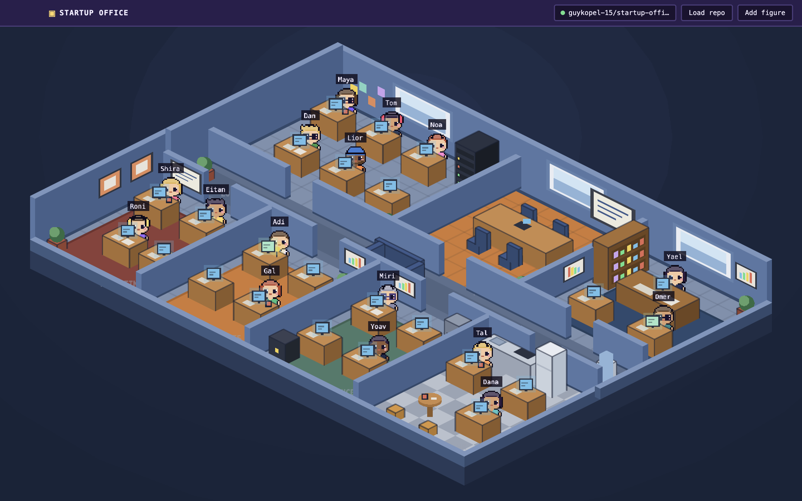

# Startup Office

## Version History

| Version | Date | Changes |
|---|---|---|
| 1.0.5 | 2026-09-14 | **Added:** Load repo dialog: paste a GitHub URL, the main process clones it shallowly into the app data folder (or pulls when it is already there) and pushes status over IPC; navbar chip with the repo name and a state dot (cloning, ready, failed); typed IPC bridge (`window.office.repo`), controller + service split, standard `successResponse` / error shape, TanStack Query hooks for main-process data. **Changed:** app-data folder pinned to `startup-office` in dev too |
| 1.0.4 | 2026-09-14 | **Added:** Add figure dialog (name, job, department with seats left, hair style, accessory, six colors, role prompt, live pixel preview); figures store (Zustand) that seats new figures on the next free desk; the scene subscribes to the store; design kit: `DSModal`, `DSField`, `DSInput`, `DSSelect`, `DSTextArea`, `DSColorInput`; one or two spare desks per department; `STARTUP_OFFICE_SCRIPT` dev hook to drive the page before a capture. **Changed:** Add figure button enabled; plants moved in R&D and Marketing to make room for the spare desks; review fixes: modal keeps focus while typing, traps Tab, restores focus and ignores drags onto the backdrop; selects show a chevron; errors linked to their inputs; store validates text; scene unsubscribes on destroy |
| 1.0.3 | 2026-09-14 | **Added:** office rebuilt to the owner's design package: opaque blue walls (tall far walls, low near rims, 0.6-tile-thick interior walls with door gaps), windows, whiteboards, charts, sticky notes, posters, rugs, per-room floors (tile, orange, checker, corridor runner), department furniture kits (server rack, bookshelf, meeting table + chairs, kitchen counter, fridge, round table, stools, water cooler, sofa, filing cabinet, safe), desk props (mug, lamp, paper, keyboard); responsive down to a 300px window: navbar collapses to icon buttons, camera fits the office and supports wheel zoom + drag pan; `STARTUP_OFFICE_WINDOW=WxH` dev override. **Changed:** window minimum 1024×640 → 300×300, responsive rule now 300px; macOS traffic-light inset applied only on macOS; review fixes: wall decor depth, click vs drag, listener teardown, exterior walls batched into one object. **Removed:** glass-wall look |
| 1.0.2 | 2026-09-14 | **Added:** desks, meeting table and reception desk in the isometric rooms; 16 default chibi figures (one per job) composed from a shared pixel template with hair styles, accessories and per-figure colors; idle bob and blink; name tag that expands to the job on hover; click emits `figure:clicked` on the game event bus. **Changed:** walls drawn per tile and depth-sorted against figures and desks; `RoomKey` moved to `src/shared/figures.ts` |
| 1.0.1 | 2026-09-14 | **Added:** isometric office floor on one page (7 rooms around a lobby corridor, glass walls, door gaps, floor slab, tile grid), app icon, dev self-screenshot hook. **Changed:** view is an isometric floor plan instead of a side-scroller; the CEO is the player outside the office, not a figure |
| 1.0.0 | 2026-09-14 | **Added:** design spec, README, coding rules (`CLAUDE.md`), Electron + React + Phaser scaffold, navbar shell, `DSButton` design kit, logger, Vitest setup |

A MapleStory-style desktop game where your startup is a pixel office and every
employee is a real Claude Code agent. You are the CEO. Walk the office, talk to
your team, hand out tasks, and watch the work flow from room to room.

> Paste a GitHub repo, and the office comes alive: the frontend dev reads your UI
> code, the backend dev reads your API, the marketer reads your landing page, and
> each one reports back in a speech bubble.

## What it is

Startup Office runs on your Mac as an Electron app with a Phaser 3 game inside.
The whole office is on one screen, an isometric floor plan in the style of the owner's
[design package](docs/design/handoff.md): opaque blue walls, windows on the far wall, a different
floor and furniture kit per department:


Every figure is drawn from one pixel template plus a hair style, an accessory and its own
colors, so adding a new employee is a data change, not new art.

| Department | Who works there |
|---|---|
| R&D | Frontend dev, Backend dev, UI/UX designer, QA engineer, DevOps |
| Product | Product manager, Data analyst |
| Marketing | Content marketer, Growth marketer, Designer |
| Sales | Sales rep, Customer success |
| Finance | Accountant, Fundraising lead |
| Ops / HR | Office manager, Recruiter |
| Meeting room | The sprint board. Figures walk here for sprint planning |
| Lobby | The corridor every room opens onto |

Every figure is an agent. Behind it runs a real `claude` CLI session with a role
prompt and your repo as its working directory. When a figure is working, it sits at
its desk typing, and its screen fills with the live output of the agent.

## How you play

1. **See everything.** The whole office fits on one page. You are the CEO looking down
   at it. You are not a figure; every figure is an employee.
2. **Load a world.** Click **Load repo** in the navbar and paste a GitHub URL. The app clones
   it into its data folder and the chip next to the button turns green. From task 7 on, every
   figure then explores the part of the code that matches its job.

   

   
3. **Talk.** Click a figure. A MapleStory-style dialog opens.
   Read the figure's report or give it a task. You can also type a task in the HUD
   chat box and the app routes it to the right figure.
4. **Run sprints.** Tasks are quests. Open the sprint board in the meeting room, drag
   quests in, and start the sprint. Figures walk to the meeting room for planning,
   then back to their desks to work.
5. **Grow the team.** Press **Add figure** in the navbar (the `+` button in a narrow window).
   Pick a department with a free desk, give the person a name, job and look, optionally a role
   prompt (it defaults from the job), and they sit down.

   
6. **Level up.** Figures gain XP for finished tasks. Failed tasks show damage numbers.
   Closing a sprint throws confetti.

## The game layer

| Element | What you get |
|---|---|
| World | Isometric floor plan: seven rooms around a lobby corridor, opaque walls with windows and decor, per-room floors and furniture |
| Characters | 4-direction walk cycles, idle bounce, desk typing animation |
| HUD | Bottom bar: company stats, quest log, chat, minimap |
| Dialog | MapleStory-style NPC dialog box for every figure |
| Juice | Level-up burst, damage numbers, confetti, chiptune per room, keyboard clatter |

## Stack

| Layer | Tech |
|---|---|
| Shell | Electron |
| UI | React, TypeScript, Vite, Zustand |
| Game | Phaser 3 |
| Agents | `claude` CLI (`claude -p`, streamed JSON) |
| Storage | JSON files in the Electron user data folder |
| Tests | Vitest, Testing Library |

## Requirements

- macOS
- Node 20+
- [Claude Code](https://claude.com/claude-code) installed and logged in (`claude` on PATH)
- `git` on PATH

## Run

```bash
npm install
npm run dev
```

Other scripts: `npm test`, `npm run typecheck`, `npm run build`, `npm run icon` (regenerates
`build/icon.png` from pixel rows), `npm run package` (dmg). Set `STARTUP_OFFICE_SCREENSHOT=out.png`
when launching to capture the window to a file and quit, which is how the README images are made.
`STARTUP_OFFICE_WINDOW=300x600` opens the window at a given size, for checking small layouts.
`STARTUP_OFFICE_SCRIPT=<file>` (together with `STARTUP_OFFICE_SCREENSHOT`) runs a script in the page
before the capture, to open dialogs or fill forms; `npm run screenshot-scripts` writes the two scripts used
for the README images into `scripts/screenshots/generated/`. All three variables are ignored in packaged builds. The app works down to a 300px wide window:


## Build plan

One task = one branch = one pull request, built in order.

| # | Task | Deliverable | Status |
|---|---|---|---|
| 0 | Spec + repo | Design doc, README, GitHub repo | ✅ |
| 1 | Electron scaffold | Window opens, React + Vite + TS, navbar shell, empty Phaser scene | ✅ |
| 2 | Office map | Isometric floor on one page: rooms, corridor, glass walls, doors, app icon | ✅ |
| 3 | Figures + desks | Desks per room, one detailed figure per job, idle animation, name tag, click emits event | ✅ |
| 4 | Office style | Owner's design package: opaque walls, windows, decor, per-room floors and furniture kits; responsive to 300px | ✅ |
| 5 | Add figure | Dialog with department, job, look and role prompt; new figure sits at a free desk | ✅ |
| 6 | Repo intake | Paste URL, clone, status in navbar | ✅ |
| 7 | Agent runner | `claude -p` per figure, streamed to a panel, intake run on repo load | ☐ |
| 8 | Figure states | idle / working / done / error, speech bubbles, desk screens | ☐ |
| 9 | NPC dialog + HUD chat | Talk to a figure, give a task, it routes to the assignee | ☐ |
| 10 | Meeting room + sprints | Sprint board, figures walk to planning, confetti on close | ☐ |
| 11 | XP + juice | Levels, level-up burst, damage numbers, sounds | ☐ |
| 12 | Persistence | Figures, tasks, sprints, world survive restart | ☐ |
| 13 | Polish | Screenshots, GIF, packaged `.dmg` | ☐ |

Full design: [docs/superpowers/specs/2026-09-14-startup-office-design.md](docs/superpowers/specs/2026-09-14-startup-office-design.md)

## Safety

Agent output is displayed, never executed. Agents run with your repo as their working
directory, so they can edit code there the same way Claude Code does on your terminal.
Review before you commit.

## License

MIT
