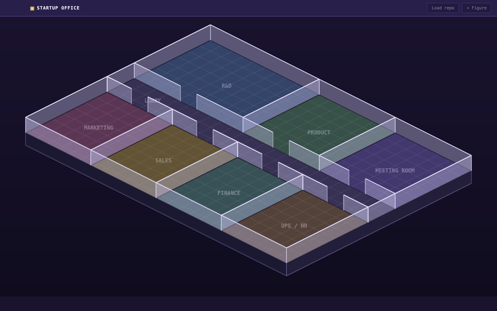

# Startup Office

## Version History

| Version | Date | Changes |
|---|---|---|
| 1.0.1 | 2026-09-14 | **Added:** isometric office floor on one page (7 rooms around a lobby corridor, glass walls, door gaps, floor slab, tile grid), app icon, dev self-screenshot hook. **Changed:** view is an isometric floor plan instead of a side-scroller; the CEO is the player outside the office, not a figure |
| 1.0.0 | 2026-09-14 | **Added:** design spec, README, coding rules (`CLAUDE.md`), Electron + React + Phaser scaffold, navbar shell, `DSButton` design kit, logger, Vitest setup |

A MapleStory-style desktop game where your startup is a pixel office and every
employee is a real Claude Code agent. You are the CEO. Walk the office, talk to
your team, hand out tasks, and watch the work flow from room to room.

> Paste a GitHub repo, and the office comes alive: the frontend dev reads your UI
> code, the backend dev reads your API, the marketer reads your landing page, and
> each one reports back in a speech bubble.

## What it is

Startup Office runs on your Mac as an Electron app with a Phaser 3 game inside.
The whole office is on one screen, an isometric floor plan with glass walls:



| Department | Who works there |
|---|---|
| R&D | Frontend dev, Backend dev, UI/UX designer, QA engineer, DevOps |
| Product | Product manager, Data analyst |
| Marketing | Content marketer, Growth marketer, Designer |
| Sales | Sales rep, Customer success |
| Finance | Accountant, Fundraising lead |
| Ops / HR | Office manager, Recruiter |
| Meeting room | The sprint board. Figures walk here for sprint planning |
| Lobby | The corridor every room opens onto |

Every figure is an agent. Behind it runs a real `claude` CLI session with a role
prompt and your repo as its working directory. When a figure is working, it sits at
its desk typing, and its screen fills with the live output of the agent.

## How you play

1. **See everything.** The whole office fits on one page. You are the CEO looking down
   at it. You are not a figure; every figure is an employee.
2. **Load a world.** Click the repo button in the navbar and paste a GitHub URL. The
   app clones it and every figure explores the part of the code that matches its job.
3. **Talk.** Click a figure. A MapleStory-style dialog opens.
   Read the figure's report or give it a task. You can also type a task in the HUD
   chat box and the app routes it to the right figure.
4. **Run sprints.** Tasks are quests. Open the sprint board in the meeting room, drag
   quests in, and start the sprint. Figures walk to the meeting room for planning,
   then back to their desks to work.
5. **Grow the team.** Press `+` in the navbar to add a figure to any department with a
   job title, a sprite, and a role prompt.
6. **Level up.** Figures gain XP for finished tasks. Failed tasks show damage numbers.
   Closing a sprint throws confetti.

## The game layer

| Element | What you get |
|---|---|
| World | Isometric floor plan: seven rooms around a lobby corridor, translucent walls, door gaps, tiled floors |
| Characters | 4-direction walk cycles, idle bounce, desk typing animation |
| HUD | Bottom bar: company stats, quest log, chat, minimap |
| Dialog | MapleStory-style NPC dialog box for every figure |
| Juice | Level-up burst, damage numbers, confetti, chiptune per room, keyboard clatter |

## Stack

| Layer | Tech |
|---|---|
| Shell | Electron |
| UI | React, TypeScript, Vite, Zustand |
| Game | Phaser 3 |
| Agents | `claude` CLI (`claude -p`, streamed JSON) |
| Storage | JSON files in the Electron user data folder |
| Tests | Vitest, Testing Library |

## Requirements

- macOS
- Node 20+
- [Claude Code](https://claude.com/claude-code) installed and logged in (`claude` on PATH)
- `git` on PATH

## Run

```bash
npm install
npm run dev
```

Other scripts: `npm test`, `npm run typecheck`, `npm run build`, `npm run icon` (regenerates
`build/icon.png` from pixel rows), `npm run package` (dmg). Set `STARTUP_OFFICE_SCREENSHOT=out.png`
when launching to capture the window to a file and quit, which is how the README images are made.

## Build plan

One task = one branch = one pull request, built in order.

| # | Task | Deliverable | Status |
|---|---|---|---|
| 0 | Spec + repo | Design doc, README, GitHub repo | ✅ |
| 1 | Electron scaffold | Window opens, React + Vite + TS, navbar shell, empty Phaser scene | ✅ |
| 2 | Office map | Isometric floor on one page: rooms, corridor, glass walls, doors, app icon | ✅ |
| 3 | Figures + desks | Desks per room, one detailed figure per job, idle animation, name tag | ☐ |
| 4 | Add figure | `+` in navbar: department, job, sprite, role prompt | ☐ |
| 5 | Repo intake | Paste URL, clone, status in navbar | ☐ |
| 6 | Agent runner | `claude -p` per figure, streamed to a panel, intake run on repo load | ☐ |
| 7 | Figure states | idle / working / done / error, speech bubbles, desk screens | ☐ |
| 8 | NPC dialog + HUD chat | Talk to a figure, give a task, it routes to the assignee | ☐ |
| 9 | Meeting room + sprints | Sprint board, figures walk to planning, confetti on close | ☐ |
| 10 | XP + juice | Levels, level-up burst, damage numbers, sounds | ☐ |
| 11 | Persistence | Figures, tasks, sprints, world survive restart | ☐ |
| 12 | Polish | Screenshots, GIF, packaged `.dmg` | ☐ |

Full design: [docs/superpowers/specs/2026-09-14-startup-office-design.md](docs/superpowers/specs/2026-09-14-startup-office-design.md)

## Safety

Agent output is displayed, never executed. Agents run with your repo as their working
directory, so they can edit code there the same way Claude Code does on your terminal.
Review before you commit.

## License

MIT
